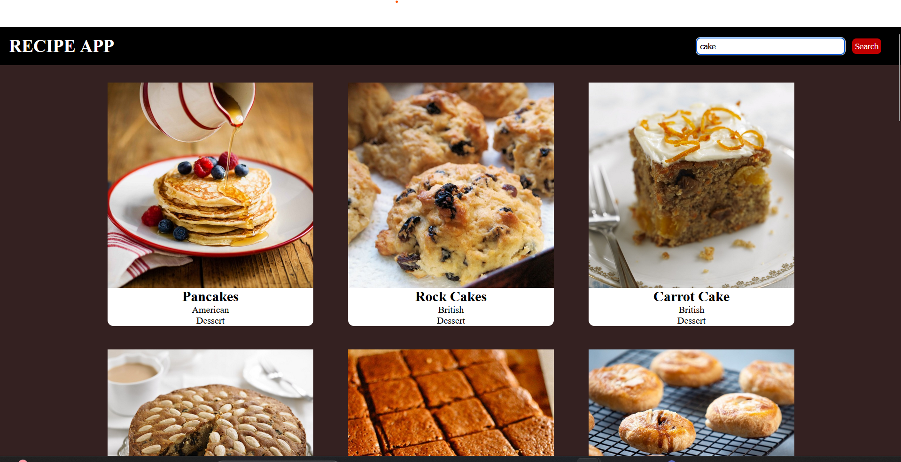

# 🍽️ Recipe App

A simple and responsive Recipe Search App built using **HTML**, **CSS**, and **JavaScript**. It fetches real-time recipe data using the **Fetch API** and displays them dynamically using **async/await**.

---

## 🔗 Live Demo

👉 [View Live on Netlify](https://684f89b3b24b59bf39aa71b2--willowy-marshmallow-90fbe9.netlify.app/)

---

## 🚀 Features

- 🔍 Search for recipes by name
- 📦 Fetches live data using `fetch()` and `async/await`
- 🧱 Responsive layout with modern CSS Grid
- 🎨 Clean and minimal UI

---

## 🛠️ Technologies Used

- HTML5
- CSS3 (Media Queries, Flexbox, Grid)
- JavaScript (ES6+)
- Fetch API
- Async/Await

---

## 📷 Screenshots

### 🔎 Search Interface

---

## 📁 Folder Structure

recipe-app/
├── index.html
├── style.css
├── app.js
└── README.md

---

## 💡 How It Works

1. User enters a search term.
2. JavaScript uses `fetch()` to call a recipe API.
3. Data is parsed and shown dynamically on the page using DOM manipulation.

---

## 🧪 Learning Highlights

This project helped me learn and practice:
- Making API requests using **Fetch API**
- Managing asynchronous code using **async/await**
- DOM manipulation based on dynamic data
- Structuring and styling a responsive web app

---

## 📬 Contact

**Himanshu Singh**  
[GitHub](https://github.com/harshsinghpujari)  
[LinkedIn](https://www.linkedin.com/in/himanshu-singh-823a0230b)

---

## ✅ Future Improvements

- Add detailed recipe pages
- Add pagination or infinite scroll
- Improve error handling (e.g., no results found)

---

